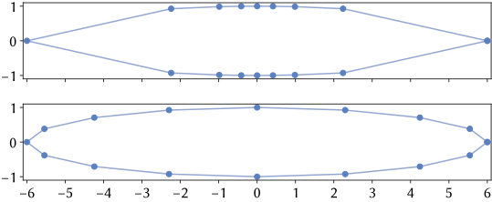

## Use of Vulkan Ray Tracing

Vulkan Ray Tracing can be optionally used in the program for different tasks.

- The rendering of lines using a hardware-accelerated ray tracer.

- Pre-baked ray-traced ambient occlusion (RTAO).

### Ray Tracing of Elliptic Tubes

There are two representations for the angle phi (see EllipticTubeRayTracing.glsl).
- Reina et al. use a parametrization p = (r(phi) * cos(phi), r(phi) * sin(phi))^T. Here, phi is a polar angle.
  r(phi) is the dilation of the unit circle into the polar direction given by phi, which is used to get an ellipse.
  r(phi) = r1 * r2 / sqrt(r1^2 * sin^2(phi) + r2^2 * cos^2(phi)) can be obtained by plugging p into the quadratic
  form x^2/r1^2 + y^2/r2^2 = 1.
- We use the parametrization p = (r1 * cos(phi), r2 * sin(phi))^T, which distributes more points close to the
  semi-major axis of the ellipse.
Thus, a conversion of one parametrization space to the other must be used in the code.

### Developer Information

According to the Vulkan specification, the following two flags can be used when creating a bottom-level ray tracing
acceleration structure.

> VK_GEOMETRY_OPAQUE_BIT_KHR indicates that this geometry does not invoke the any-hit shaders even if present in a hit
> group.

> VK_GEOMETRY_NO_DUPLICATE_ANY_HIT_INVOCATION_BIT_KHR indicates that the implementation must only call the any-hit
> shader a single time for each primitive in this geometry. If this bit is absent an implementation may invoke the
> any-hit shader more than once for this geometry.

Source: https://www.khronos.org/registry/vulkan/specs/1.2-extensions/html/vkspec.html

When creating the bottom-level ray tracing acceleration structures for the program, the flag
VK_GEOMETRY_NO_DUPLICATE_ANY_HIT_INVOCATION_BIT_KHR is used. VK_GEOMETRY_NO_DUPLICATE_ANY_HIT_INVOCATION_BIT_KHR makes
sure that, when using any-hit shaders with multi-layer alpha tracing (MLAT), the any-hit shader is only called once.
Using this flag should have no negative performance side effects when not providing any any-hit shader at all.

While gl_RayFlagsOpaqueEXT is used in the ray-gen shader when not using MLAT, not using VK_GEOMETRY_OPAQUE_BIT_KHR
should also not affect the performance in a negative way, as no any-hit shaders are provided in this case. Thus, the
flag should not cause any different behavior anyway.
